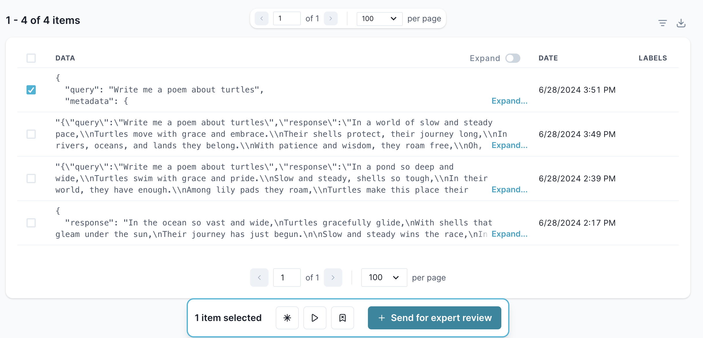
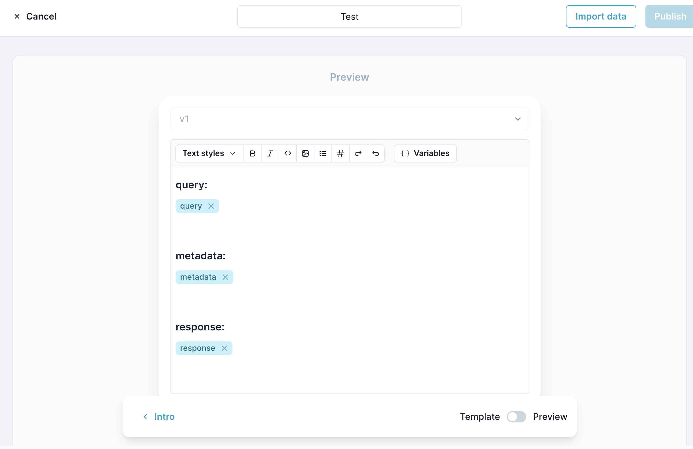

# melodi-sdk-typescript

Thin sdk for getting your data into Melodi

# Create logs in Melodi

Log an llm response to Melodi.

```
createLog(
  {
    data: string | object,
    projectName: string (optional),
    versionName: string (optional)
  },
  apiKey (optional, either include here or as the environment variable MELODI_API_KEY)
)
```

Example:

```
await createLog(
  {
    data: 'This is the response from an llm.',
    projectName: 'SDK test',
    versionName: 'v1'
  },
  'my_api_key'
)
```

If you pass an object into "data" the different fields will be available in the template when creating an evaluation:

```
await createLog(
  {
    data: {
      query: 'Write me a short poem about turtles',
      response: 'In the deep blue sea they glide, with shells that shimmer in the tide.`,
      metadata: {
        timestamp: Date.now(),
        type: 'test'
      }
    },
    projectName: 'SDK test',
    versionName: 'v1'
  },
  'my_api_key'
)
```

You can view created logs in the Melodi app at https://app.melodi.fyi/admin/logs
and create an evaluation by selected the logs and clicking "Send for expert review"



And from there adjust the template using the fields included in "data" above:


